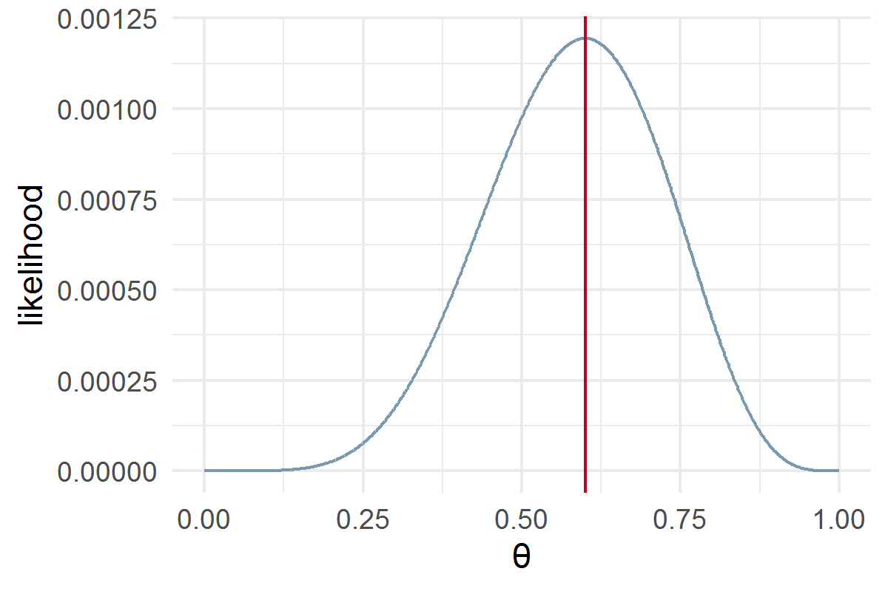
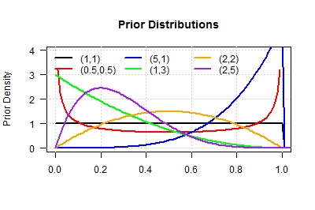
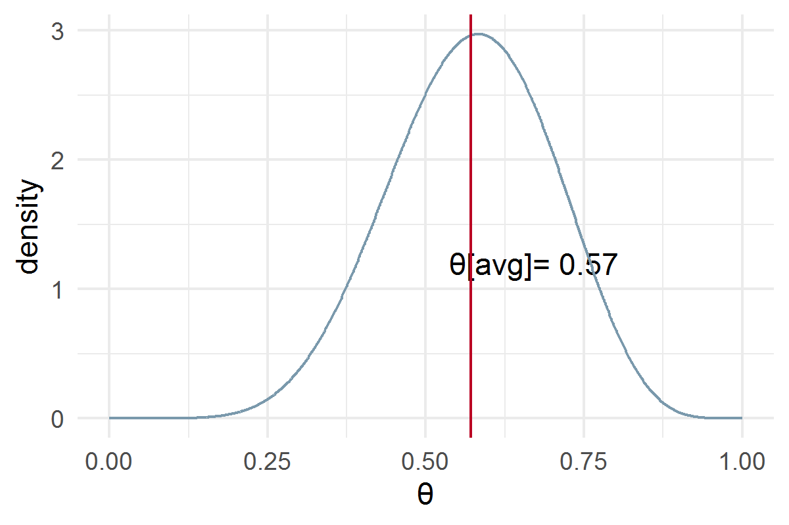
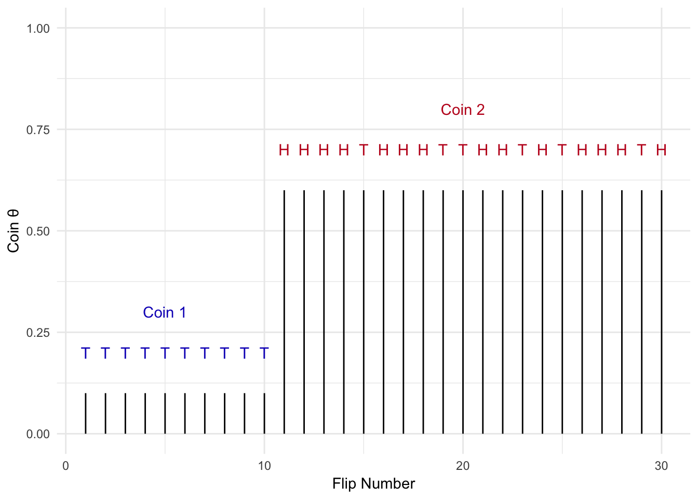
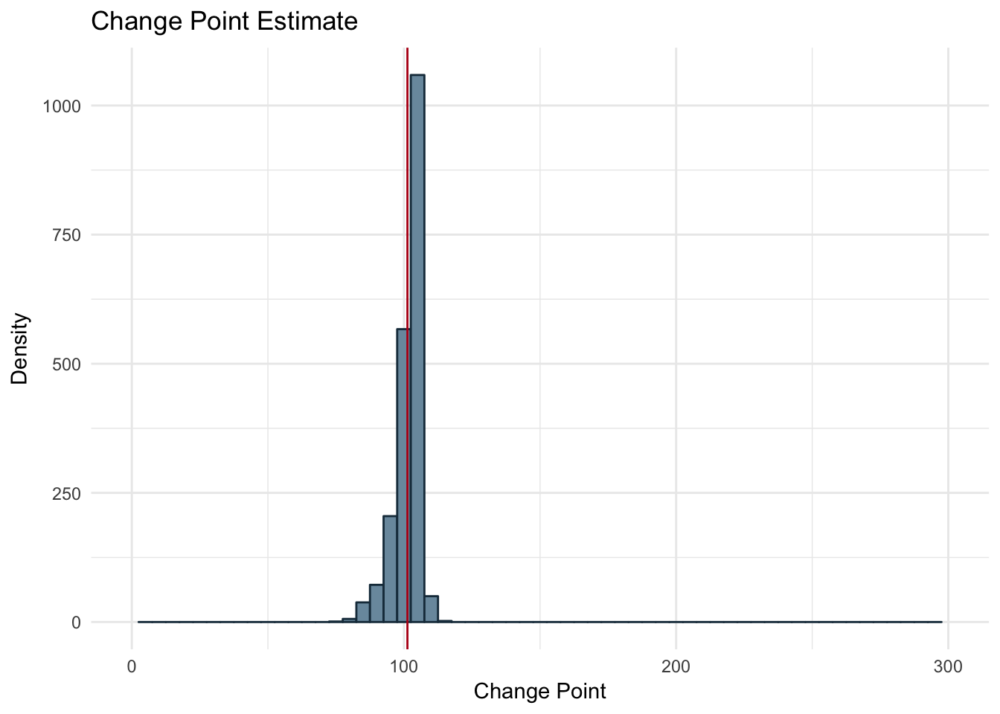

```{r setup, include=FALSE}
knitr::opts_chunk$set(echo = FALSE, message=FALSE, warning=FALSE, fig.align = "center")#, fig.height=4, fig.width=6) 
library(ggplot2)
```

# Motivation

## Rejection Sampling


Last week we learned about a "general workhorse" MCMC algorithm, the \textit{Metropolis Hastings Algorithm}. While it is a powerful and versatile "hill climbing" sampling scheme, there are a few challenges: 

\begin{itemize}
  \item Designing a proposal distribution can be tricky
  \item Tradeoff between bandwidth and sampling efficiency (number of rejected samples)
  \item Hyperparameter tuning
\end{itemize}

## Hierarchical Models

Gibbs sampling is another MCMC method which works if all conditional posterior densities can be explicitly derived.

\begin{itemize}
  \item No specially designed proposal distributions 
  \item No rejected samples
  \item No hyperparameter tuning
  \item Conditionals eays for most hierarchical models
  \item Very popular in machine learning, e.g. LDA, Bayesian Networks, NLP 
\end{itemize}

# Estimation 

## Maximum Likelihood

Let’s say I’ve flipped a coin $10$ times and got $6$ heads, $4$ tails. 
Each coin flip is independent so the likelihood of a value of $\theta$ given our observed data is:
$$
P(X_1 = x_1, \ldots ,X_{10} = x_{10}) = L(\theta) = \prod_{i=1}^{10}{\theta^{x_i} (1-\theta)^{1-x_i}} = \theta^{6} (1-\theta)^{4}
$$

```{r, out.height="4cm", out.width="6cm"}

n <- 10
heads <- 6
tails <- n-heads


B <- 2
alpha <- 2
map_theta <- (heads)/(n)
possible_theta <- seq(0,1,0.001)

beta_ds <- data.frame(theta = possible_theta, likelihood = possible_theta^heads * (1-possible_theta)^(tails))
g = ggplot(beta_ds, aes(x = theta, y = likelihood)) + geom_line(color='#7A99AC') + 
  geom_vline(xintercept=map_theta, color = '#ba0223') + xlab('\U03B8') + theme_minimal()

ggsave("figures/LikelihoodCoin.png",g,  width = 4, height = 4*2/3)
#     labs(x='\U03B8', y = 'likelihood') 


```


## Beta Binomial 1

\begin{equation}
\underbrace{p(\theta|D)}_{posterior} = {\overbrace{p(D|\theta)}^{likelihood}
  \overbrace{p(\theta)}^{prior} \over \underbrace{p(D)}_{evidence}}
\end{equation}

\begin{equation}
\underbrace{p(\theta|D)}_{posterior}  \propto  {\overbrace{p(D|\theta)}^{likelihood}
  \overbrace{p(\theta)}^{prior}}
\end{equation}

To estimate the posterior of the bernoulli distribution we plug in our likelihood and prior (Beta distribution) 

## Bayesian Estimate

The Beta distribution is a conjugate distribution of the binomial distribution.

$$
\pi(\theta | \alpha, \beta) = Beta(\alpha, \beta) = \theta^{\alpha-1} \cdot (1-\theta)^{\beta-1}/B(\alpha, \beta)
$$

```{r, results='hide'}

colors = c("black","red","blue","green","orange","purple")

n = 10
N = 10
theta = .2

x = rbinom(n,N,theta)
grid = seq(0,2,.01)

alpha = c(1,.5,5,1,2,2)
beta = c(1,.5,1,3,2,5)


png("figures/BetaPriors.png", width = 400, height = 400*2/3)
 
plot(grid,grid,type="n",xlim=c(0,1),ylim=c(0,4),xlab="",ylab="Prior Density",
     main="Prior Distributions", las=1);grid()
for(i in 1:length(alpha)){
    prior = dbeta(grid,alpha[i],beta[i])
    lines(grid,prior,col=colors[i],lwd=2)
}

legend("topleft", legend=c("(1,1)", "(0.5,0.5)", "(5,1)", "(1,3)", "(2,2)", "(2,5)"), lwd=rep(2,5), col=colors, bty="n", ncol=3)#, title = expression(alpha~","~beta) )

dev.off()
```

```{r, out.height="6cm", out.width="8cm"}


```


## Beta Binomial 2

\begin{equation}
p(\theta|z,N) \propto \overbrace{\theta^z(1-\theta)^{(N-z)}}^{likelihood} \overbrace{{\theta^{(\alpha-1)}(1-\theta)^{(\beta-1)}}\over B(\alpha,\beta)}^{prior}
\end{equation}

\begin{equation}
\begin{aligned}
p(\theta|z,N) &\propto {\overbrace{\theta^{(\alpha + z -1)}(1-\theta)^{(N-z+\beta-1)}}^{Same \hspace{1 mm} Pattern \hspace{1 mm} as \hspace{1 mm} Prior}\over{B(\alpha,\beta)}}\\
p(\theta|z,N) &\propto Beta(\alpha+z, N-z+\beta)
\end{aligned}
\end{equation}


## Posterior Density

Choose a "weakly informative" prior: $\alpha=\beta=2$;
Weighted Average of prior and data based likelihood!
$$\hat{\theta} = \frac{6+2}{10+4}$$


```{r, eval=TRUE, out.height="4cm", out.width="6cm"}

n <- 10
heads <- 6
tails <- n-heads


B <- 2
alpha <- 2
map_theta <- (heads + alpha)/(heads + tails + alpha + B)
possible_theta <- seq(0,1,0.001)

beta_ds <- data.frame(theta = possible_theta, prior = dbeta(possible_theta, alpha , B), density = dbeta(possible_theta, heads + alpha ,tails + B))
g = ggplot(beta_ds, aes(x = theta, y = density)) +   annotate("text", x = map_theta + 0.1, y=1.2, label= paste("\U03B8[avg]=", round(map_theta,2))) + geom_line(color='#7A99AC') + xlab('\U03B8') + 
  geom_vline(xintercept=map_theta, color = '#ba0223') + theme_minimal()

ggsave("figures/PosteriorBeta.png",g,  width = 4, height = 4*2/3)



```

## Sampling = Estimating

The coin flip example solved via Bayesian inference was capable of being solved analytically. However in many cases of Bayesian inference this is not possible due to the intractability of solving for the marginal likelihood (evidence term). Imagine we could sample from the posterior:

```{r,out.height="4cm", out.width="6cm"}
set.seed(123)
par(cex=1.75)
theta = rbeta(n=100000,heads + alpha ,tails + B)
hist(theta,col="bisque", main = "Sampling the posterior",xlab='\U03B8', freq = FALSE);grid()
PosMean = round(mean(theta),2)
abline(v=PosMean,col=2,lty=2)
mtext(side=1, at = PosMean + 0.1, line=0.2, text= paste("\U03B8[avg]=", round(PosMean,2)))
```

## Change Point Example

\footnotesize
What if the problem we are solving is more complicated? Let’s say I flip a coin repeatedly, but at some point I switch to another coin with a different bias $(\theta)$. I want to detect the point in time when coin 1 was swapped out for coin 2.
```{r, eval=TRUE, out.height="6cm", out.width="8cm"}


```

## Generative Model
\footnotesize
In this case we have 3 variables that we need to estimate:
\begin{enumerate}
  \item Coin bias for coin 1: $\theta_1$
  \item Coin bias for coin 2: $\theta_2$
  \item The point in time, i.e. on which flip, the coin was swapped: $n$
\end{enumerate}
We assume that all values of n are equally probable and therefore can be modeled as a uniform distribution.

\begin{equation}
\begin{aligned}
  x &\sim   
  \begin{cases}
      Bern(x_{i};\theta_{1}) \quad 1 \le i \le n \\
      Bern(x_{i};\theta_{2}) \quad n < i < N  
  \end{cases} \\
  n &\sim Uniform(2...N) \\
  \theta_{i} &\sim Beta(\theta_{i}, \alpha_i,\beta_i)
\end{aligned}
\end{equation}


## Joint Distribution

\footnotesize
\begin{equation}
p(\theta_{1}, \theta_{2}, n| x_{1:N}) \propto \overbrace{p(x_{1:n}|\theta_{1},n)
p(x_{n+1:N}|\theta_{2},n)}^{Likelihoods}
\overbrace{p(\theta_{1})p(\theta_{2})p(n)}^{Priors}
\end{equation}

\begin{equation}
\label{eq:ChgPtJoint}
\begin{aligned}
p(\theta_{1}, \theta_{2}, n| x_{1:N}) &\propto 
  \prod_{1}^{n}p(x_{i}|\theta_{1})
  \prod_{n+1}^{N}p(x_{i}|\theta_{2})
  p(\theta_{1})p(\theta_{2})p(n)\\
&\propto [\theta_{1}^{z_{1}}(1-\theta_{1})^{n-z_{1}}]
  [\theta_{2}^{z_{2}}(1-\theta_{2})^{N-(n+1)-z_{2}}]
  p(\theta_{1})p(\theta_{2})p(n)\\
  \\
&\propto [\theta_{1}^{z_{1}}(1-\theta_{1})^{n-z_{1}}]
  [\theta_{2}^{z_{2}}(1-\theta_{2})^{N-(n+1)-z_{2}}] \cdot \\
 & {{\theta_{1}^{(\alpha_{1}-1)}(1-\theta_{1})^{(\beta_{1}-1)}}\over B(\alpha_{1},\beta_{1})}
  {{\theta_{2}^{(\alpha_{2}-1)}(1-\theta_{2})^{(\beta_{2}-1)}}\over B(\alpha_{2},\beta_{2})}\\
  \\
\end{aligned}
\end{equation}

## Conditionals
\footnotesize
Not clear how to sample from (\ref{eq:ChgPtJoint}) at all !
We see that only the likelihood terms contain n. Using these terms we can solve for the posterior conditional.
\begin{equation}
\begin{aligned}
p(n| x_{1:n}, \theta_{1}, \theta_{2}) &\propto  [\theta_{1}^{z_{1}}(1-\theta_{1})^{n-z_{1}}]
  [\theta_{2}^{z_{2}}(1-\theta_{2})^{N-(n+1)-z_{2}}]\\
%log(p(n| x_{1:N}, \theta_{1}, \theta_{2})) &\propto  
%  log([\theta_{1}^{z_{1}}(1-\theta_{1})^{n-z_{1}}]) +
%  log([\theta_{2}^{z_{2}}(1-\theta_{2})^{N-(n+1)-z_{2}}])
\end{aligned}
\end{equation}
We utilize the conjugate prior relationship between the likelihoods and the priors and collapse the priors and likelihoods for the $\theta$ values.

\begin{equation}
\begin{aligned}
p(\theta_{1}, \theta_{2}, n| x_{1:N}) &\propto            
  [\theta_{1}^{(z_{1}+\alpha_{1}-1)}(1-\theta_{1})^{(n-z_{1}+\beta_{1}-1)}]
  [\theta_{2}^{(z_{2}+\alpha_{2}-1)}(1-\theta_{2})^{(N-n-1-z_{2}+\beta_{2}-1)}]\\
&\propto Beta(\alpha_{1}+z_{1}, n-z_{1}+\beta_{1}) Beta(z_{2}+\alpha_{2}, N-n-1-z_{2}+\beta_{2})
\end{aligned}
\end{equation}


## Conditional Posteriors

\footnotesize

We can now solve for each of the $\theta$’s posterior conditionals.


\begin{equation}
\begin{aligned}
p(\theta_{1}| x_{1:n},\theta_{2}, n) &\propto Beta(a_{1}+z_{1}, n-z_{1}+b_{1})\\
% log(p(\theta_{1}| x_{1:n},\theta_{2}, n)) &\propto log(Beta(a_{1}+z_{1}, n-z_{1}+b_{1}))
\end{aligned}
\end{equation}
\begin{equation}
\begin{aligned}
p(\theta_{2}| x_{1:N},\theta_{1}, n) &\propto Beta(z_{2}+a_{2}, N-n-1-z_{2}+b_{2})\\
% log(p(\theta_{2}| x_{1:N},\theta_{1}, n)) &\propto log(Beta(z_{2}+a_{2}, N-n-1-z_{2}+b_{2}))
\end{aligned}
\end{equation}

So what is this good for ?


# Gibbs Sampler

## Gibbs Sampling

\footnotesize

Gibbs sampling works by estimating all parameters via the posterior conditional iteratively for a set number of iterations or a distinct stopping criteria/convergence measure.

\begin{equation}
\begin{aligned}
For \ i \ in \ iterations:\\
&p(\theta_{1}^{i+1}) \sim p(\theta_{1}^{i}|\theta_{2}^{i}, \theta_{3}^{i},..., \theta{n}^{i}) \\
&p(\theta_{2}^{i+1}) \sim p(\theta_{2}^{i}|\theta_{1}^{i+1}, \theta_{3}^{i},..., \theta{n}^{i}) \\
&p(\theta_{3}^{i+1}) \sim p(\theta_{3}^{i}|\theta_{1}^{i+1}, \theta_{2}^{i+1},..., \theta{n}^{i}) \\
&................................ \\ 
&p(\theta_{n}^{i+1}) \sim p(\theta_{n}^{i}|\theta_{1}^{i+1}, \theta_{2}^{i+1},..., \theta_{n-1}^{i+1}) \\
\end{aligned}
\end{equation}

## Gibbs Sampling
\footnotesize
The red circles represent the parameters yet to be estimated in this iteration where the blue represent those that have been previously estimated during the current iteration. Note that the purple circle in each row is the parameter currently being estimated in that step (the current row) and that it takes into account all the available info, i.e. all the red and blue circles in that row.

```{r, eval=TRUE, out.height="5cm", out.width="8cm"}
knitr::include_graphics("figures/ldaFig2_12_GibbsSamplingViz.png")

```


## Base R Code

```{r, eval=TRUE, out.height="6cm", out.width="8cm"}


```

## Latent Variables
\footnotesize

The above task is trivial if one knew the value of $n$ beforehand.
In fact, a human would eye-ball the change point and quickly compute the 2 separate means.

In machine learning, we would say that there is a \textit{latent variable} ($n$) which is missing but knowledge of which greatly simplifies the problem!

Instead of viewing the above as a change point detection, the task can be phrased as a clustering problem: find the best partition into 2 groups.

Let us briefly review the most basic clustering algorithm.

## K-means Clustering

One chooses the desired number of cluster centers, say
R, and the K-means procedure iteratively moves the centers to minimize
the total within cluster variance. Given an initial set of centers, the K-means algorithm alternates the two steps:
\begin{enumerate}
  \item for each center we identify the subset of training points (its cluster) that is closer to it than any other center;
  \item  the means of each feature for the data points in each cluster are
computed, and this mean vector becomes the new center for that cluster.
\end{enumerate}
These two steps are iterated until convergence. Typically the initial centers are R randomly chosen observations from the training data


## Iterative Procedure

```{r, eval=TRUE, out.height="7.5cm"}
knitr::include_graphics("figures/ISLR_fig10-6_KMeans.pdf")

```


# The EM Algorithm

## Gaussian Mixtures as Soft K-means Clustering
\footnotesize

Generative Model
\begin{equation}
\begin{aligned}
Y_1 &\propto N(\mu_1,\sigma_1)\\
Y_2 &\propto N(\mu_2,\sigma_2)\\
Y &= \Delta \cdot Y_1 + (1- \Delta) \cdot Y_2 
\end{aligned}
\end{equation}
Direct maximization of likelihood is difficult numerically, but if we knew the \textbf{unobserved latent} variables $\Delta$, it would be simple.

```{r, eval=TRUE, out.height="5cm"}
knitr::include_graphics("figures/ESL-Fig8-5.pdf")

```

## The EM algorithm

```{r, eval=TRUE, out.height="7cm"}
#knitr::include_graphics("figures/ESL_Alg8-1_EM.png")
knitr::include_graphics("figures/ESL-Alg8-1.pdf")
```


## Gibbs and EM


Gibbs sampling is closely related to the EM algorithm: the main difference
is that it samples from the conditional distributions rather than
maximizing over them.


```{r, eval=TRUE, out.height="7cm"}
#knitr::include_graphics("figures/ESL_Alg8-1_EM.png")
  knitr::include_graphics("figures/ESL-Alg8-4.pdf")
```

## Gibbs and EM, details

\footnotesize


The key is to consider the latent data $Z^m$ from the EM procedure to be another parameter for the Gibbs sampler. To make this explicit for the Gaussian mixture problem, we take our parameters to be $(\theta, Z^m)$. For simplicity we fix the variances $\sigma_1^2,\sigma_2^2$ and mixing proportion $\pi$ at their maximum likelihood values so that
the only unknown parameters in $\theta$  are the means $\mu_1$ and $\mu_2$. The Gibbs sampler for the mixture problem is given in Algorithm 8.4.

We see that steps 2(a) and 2(b) are the same as the E and M steps of the EM procedure, except that we sample rather than maximize. In step 2(a), rather
than compute the maximum likelihood responsibilities $\gamma_i = E(\Delta_i | \theta, Z^m)$,
the Gibbs sampling procedure simulates the latent data $\Delta_i$ from the distributions $Pr(\Delta_i | \theta, Z^m)$. In step 2(b), rather than compute the maximizers of
the posterior $Pr(\mu_1, \mu_2, \Delta |Z )$ we simulate from the conditional distribution $Pr(\mu_1, \mu_2, \Delta |Z )$.

```{r child = 'LDA.Rmd'}
```

# Software & References

## Software

\begin{itemize}
  \item The \textbf{OpenBUGS} software (Bayesian inference Using Gibbs Sampling) does a Bayesian analysis of complex statistical models using Markov chain Monte Carlo.

   \item  \textbf{JAGS} (Just another Gibbs sampler) is a GPL program for analysis of Bayesian hierarchical models using Markov Chain Monte Carlo.

  \item \textbf{PyMC3} is an open source Python library for Bayesian learning of general Probabilistic Graphical Model with advanced features and easy to use interface.

  \item \textbf{Turing} is a Julia package that allows multiple sampler types to be run as components of Gibbs sampling. 

\end{itemize}

## RJAGS

## Closing Remarks 

\footnotesize

* Generally, samples from the beginning of the chain (the burn-in period) may not accurately represent the desired distribution and are usually discarded.

* A \textbf{blocked Gibbs sampler} groups two or more variables together and samples from their joint distribution conditioned on all other variables, rather than sampling from each one individually.

* A \textbf{collapsed Gibbs sampler} integrates out (marginalizes over) one or more variables when sampling for some other variable.

* Failure modes:
  * islands of high-probability states, with no paths between them
  * all states have nonzero probability and there is only a single island of high-probability states

## Further References

\begin{itemize}

  \item  \href{http://users.umiacs.umd.edu/~jbg/}{\color{blue}{Jordan Boyd Graber at UMD}}: 
 \begin{itemize}
      \item   Videos, e.g. \href{https://www.youtube.com/watch?v=u7l5hhmdc0M}{\color{blue}{Topic Models: Gibbs Sampling}} or \href{https://www.youtube.com/watch?v=CEVELIz4WXM}{\color{blue}{Beta and Dirichlet Distributions}} or \href{https://www.youtube.com/watch?v=0NMC2NfJGqo}{\color{blue}{Clustering: Gaussian Mixture Models}} 
    
  \item \href{https://github.com/ezubaric/TM_applications_book}{\color{blue}{book}} on Applications of Topic Models
  \end{itemize}
  \item  \href{https://ldabook.com}{\color{blue}{The Little LDA book}}
  
  
  \item  \href{https://web.stanford.edu/~hastie/Papers/ESLII}{\color{blue}{The Elements of Statistical Learning}} 
  \item    \href{http://topicmodels.west.uni-koblenz.de/}{\color{blue}{Uni Koblenz}}, e.g. \href{http://topicmodels.west.uni-koblenz.de/ckling/tmt/restaurant.html?parameters=1\%2C2\%2C1\%2C2\%2C1\%2C3\#}{\color{blue}{Animation Polya urn}} 

  \item    \href{https://www.tidytextmining.com/}{\color{blue}{Tidy Text Mining}}, chapter 6
\end{itemize}

