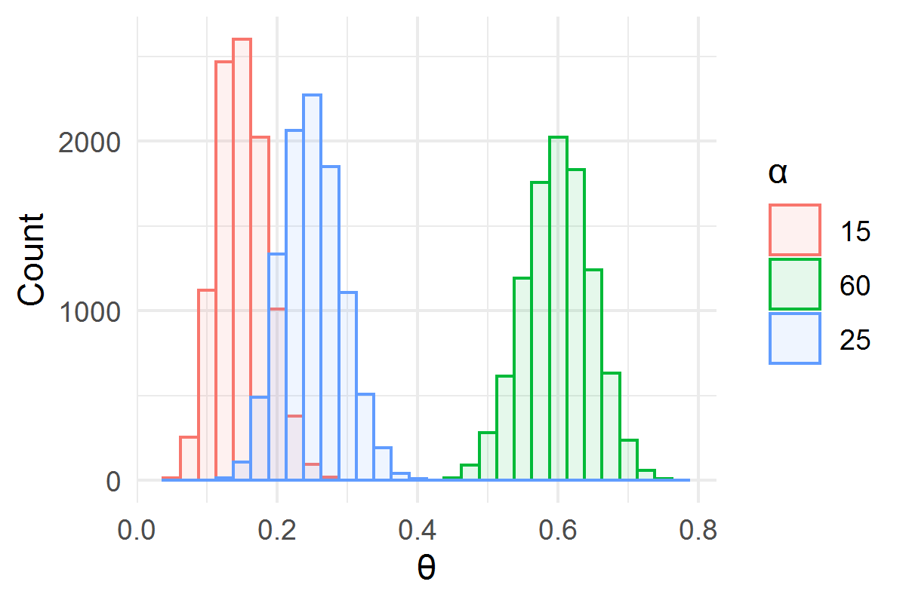
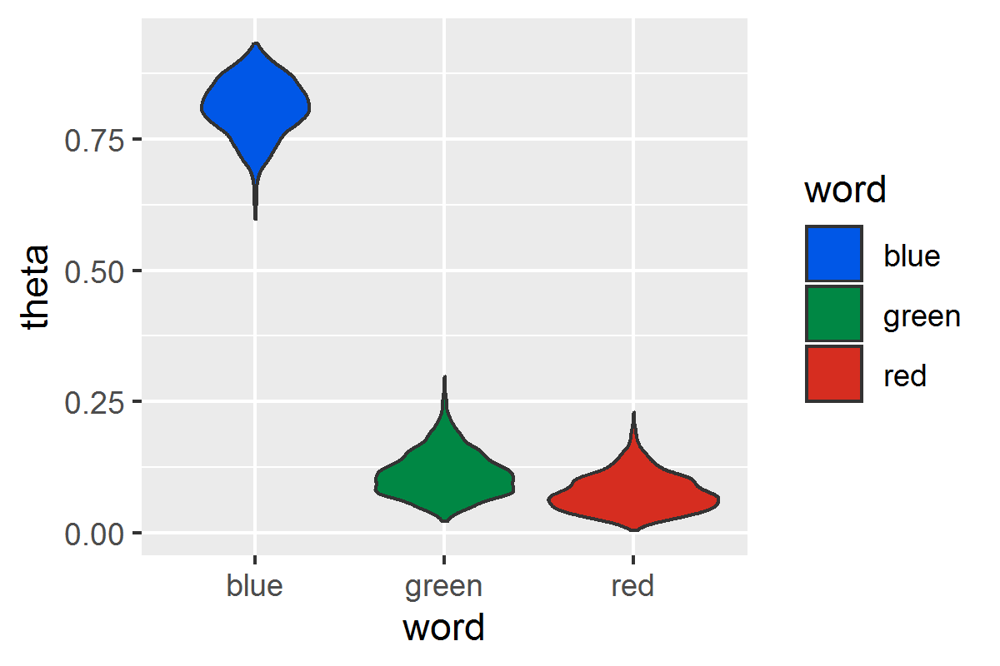
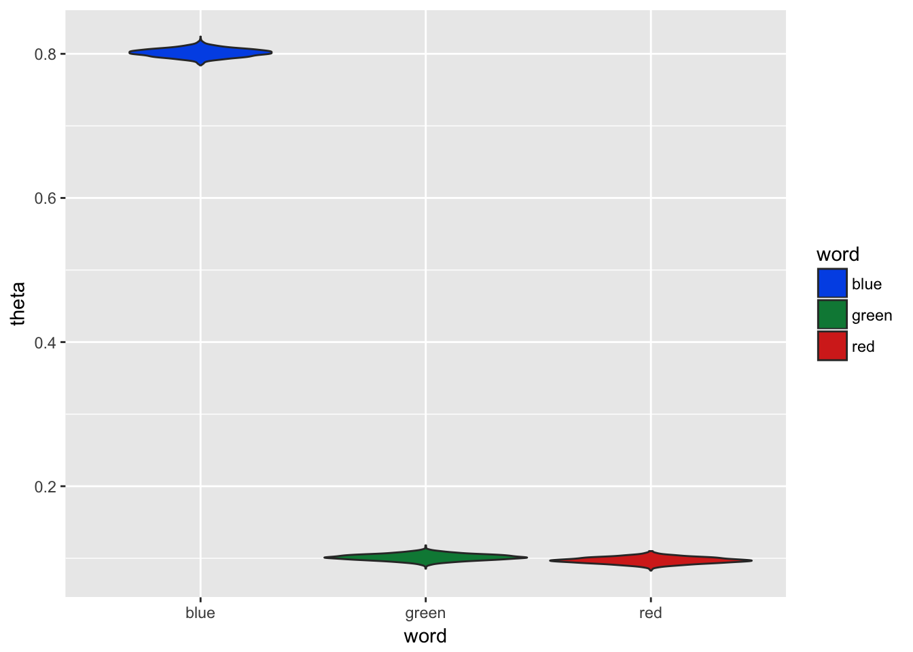

```{r setup2, include=FALSE}
knitr::opts_chunk$set(echo = FALSE, message=FALSE, warning=FALSE, fig.align = "center")#, fig.height=4, fig.width=6) 
library(ggplot2)
library(dplyr)
library(tidyverse)
library(MCMCpack)
```

# Multinomial

## Multinomial <-> Dirichlet

\footnotesize
\textbf{How Multinomial and Bernoulli Relate}

\begin{equation}
f(x)=\dfrac{n!}{x_1!x_2!\cdots x_K!}\theta_1^{x_1} \theta_2^{x_2} \cdots \theta_k^{x_K}
\end{equation}

The \textbf{conjugate prior} for the multinomial distribution is the \textbf{Dirichlet} distribution. Similar
to the beta distribution, Dirichlet can be thought of as a distribution of distributions. Also note that the beta distribution is the special case of a Dirichlet distribution where the number of possible outcomes is 2. This is similar to the relationship between the binomial and multinomial distributions. 


\begin{equation}
Dir(\overrightarrow{\theta}|\overrightarrow{\alpha})=
{ 
  {\Gamma {\bigl (}\sum _{i=1}^{K}\alpha _{i}{\bigr )}}
  \over{\prod _{i=1}^{K}\Gamma (\alpha _{i})}
}
\prod _{i=1}^{K}\theta_{i}^{\alpha _{i}-1} =
{ 
  1 \over B(\alpha)
}
\prod _{i=1}^{K}\theta_{i}^{\alpha _{i}-1} 
\end{equation}

## Sampling from Dirichlet

\footnotesize

The distribution of samples for each category ($\alpha_{i}$ value), are approximately centered at the ratio of the $\alpha_{i}$ value to the sum of all $\alpha$ values.

```{r,eval=FALSE}
alpha <- c(15,60,25)
trials <- 10000
alpha_prop <- alpha/sum(alpha)
x <- MCMCpack::rdirichlet(trials, alpha)
colnames(x) <- c('theta_1', 'theta_2', 'theta_3')
ds <- cbind(as.tibble(x), trial = 1:trials) %>% 
  gather(theta, word, -trial)

g=ggplot(ds, aes(color = theta, fill=theta, x = word)) + geom_histogram(position='identity', alpha = 0.1) +
  # geom_line(stat='density') + 
  theme_minimal() + 
  labs(x = "\U03B8", y = "Count") + 
  scale_color_discrete(label = alpha,
                       name = "\U03B1" ) +
  scale_fill_discrete(label = alpha,
                       name = "\U03B1" )
ggsave("figures/DirchletSamples1.png",g,  width = 4, height = 4*2/3)
```
```{r DirichletAlphaMixed, out.height="4cm", out.width="6cm"}

```

This is similar to the shift of the beta distribution when using hyperparameters that are unequal.

## Dirichlet - Multinomial

\footnotesize

The multinomial distribution with parameters $\overrightarrow{\theta} = \theta_{1}, \theta_{2}, ... \theta_{n}$ for words $1$ to $n$ would be capable of generating a bag of words (BOW) representation of a document. The model will be used to generate a document using a limited vocabulary, only 3 distinct words:  $\color{blue} \Delta, \color{red} \Omega, \color{darkgreen} \Psi$., in particular using the word counts as our $\alpha$ values for the dirichlet   prior. 
```{r unigram_document,eval=TRUE, results='asis'}
# use letters function as your vocabulary
v <- c('blue', 'red', 'darkgreen')
nwords <- 10
doc_theta <- c(.8, .1, .1)
document<-rep(v, doc_theta*nwords)
books <- tibble(label = v, 
                    code = c('$\\color{blue} \\Delta$', '$\\color{red} \\Omega$', '$\\color{darkgreen} \\Psi$'))

cat(sapply(document, function(x) books$code[which(books$label == x)]))
``` 

Then we use the $\theta$ values generated by the dirichlet prior as the parameters for a multinomial distribution to generate the next term in the document.


```{r multiple_docs_mul_dir, cache = FALSE, results='asis'}
#library(xtable)
words <- document
word_counts <- table(words)
alphas <-  word_counts

alphas <-  word_counts
nwords <- 10
ndocs  <- 5
word_encodings <- tibble(label = v, 
                    code = c('$\\color{blue} \\Delta$', '$\\color{red} \\Omega$', '$\\color{darkgreen} \\Psi$'),
                    word_props = doc_theta)


thetas <- MCMCpack::rdirichlet(ndocs*nwords, alphas)
#print(head(thetas))

selected_words <- apply(thetas, 1, function(x) which(rmultinom(1,1,x)==1))

ds <- tibble(doc_id = rep(1:ndocs, each = nwords),
             word = word_encodings$label[selected_words], 
             word_uni = word_encodings$code[selected_words])


ds2 <- ds %>% group_by(doc_id) %>% summarise(
  tokens = paste(word_uni, collapse = ' '))#  %>% knitr::kable(col.names = c('Document', 'Words'), format = "latex") 


 ds3 = as.matrix(ds2)#gsub("","\\",ds2)
for (i in 1:5) cat(ds3[i,],"\\newline")
# colnames(ds2) = c('Document', 'Words')
# print(xtable(ds2), comment = FALSE, include.rownames=FALSE)
```

## Inference I

\footnotesize
The process above is a \textbf{generative model}. Now we are going to take a series of pre-existing documents and infer what model created them

Once we plug in the prior and likelihood and simplify, we find that we are left with a Dirichlet PDF with the input parameters of $\overrightarrow{\alpha} + \overrightarrow{n}$ where _n_ are the observed word counts.  

\begin{equation}
\begin{aligned}
p(\theta|D) &\propto p(D|\theta)p(\theta)\\
&\propto \prod _{i=1}^{K}\theta^{n(k)} { 
  {\Gamma {\bigl (}\sum _{i=1}^{K}\alpha _{i}{\bigr )}}
  \over{\prod _{i=1}^{K}\Gamma (\alpha _{i})}
}
\prod _{i=1}^{K}\theta_{i}^{\alpha _{i}-1} \\
&\propto{ 
  {\Gamma {\bigl (}\sum _{i=1}^{K}\alpha _{i}{\bigr )}}
  \over{\prod _{i=1}^{K}\Gamma (\alpha _{i})}
}\prod _{i=1}^{K}\theta_{i}^{\alpha _{i}+n_{k}-1} \\
&\propto Dir(\overrightarrow{\alpha} + \overrightarrow{n})
\end{aligned}
\end{equation}

## Inference II

Let's use the 5 documents we previously generated as our basis and infer the parameters used to generate them via Gibbs sampling. 

```{r unigramInference10, eval = FALSE, fig.cap='Gibbs Sampling with 5 Documents'}

alphas <- rep(1,nrow(books))
n <- table(ds$word)

niters = 2000
burnin = 500

thetas = matrix(0, nrow = (niters-burnin), ncol=nrow(books), 
                dimnames = list(NULL, c(names(n))))
for (i in 1:niters){
  theta = rdirichlet(1,n+alphas)

  
  if (i >= burnin){
    thetas[(i-burnin), ] = theta
  }
}


 df <- as.tibble(thetas) %>% 
   gather(word, theta)
g = ggplot(df, aes(y=theta, x = word, fill=word)) + geom_violin() +
  scale_fill_manual(values=c('#0057e7',  '#008744','#d62d20'))

ggsave("figures/unigramInference10.png",g,  width = 4, height = 4*2/3)
#     labs(x='\U03B8', y = 'likelihood') 

```

```{r, out.height="6cm", out.width="8cm"}


```

## Inference III

Instead of just 5 documents we will generate 500 and use this as our sample to infer the word mixtures from.  

```{r, out.height="6cm", out.width="8cm"}


```

# LDA

## Latent Dirichlet allocation

\footnotesize

Latent Dirichlet allocation is one of the most common algorithms for topic modeling. It is guided by two principles.

* **Every document is a mixture of topics.** We imagine that each document may contain words from several topics in particular proportions. For example, in a two-topic model we could say "Document 1 is 90% topic A and 10% topic B, while Document 2 is 30% topic A and 70% topic B."
* **Every topic is a mixture of words.** For example, we could imagine a two-topic model of American news, with one topic for "politics" and one for "entertainment." The most common words in the politics topic might be "President", "Congress", and "government", while the entertainment topic may be made up of words such as "movies", "television", and "actor". Importantly, words can be shared between topics; a word like "budget" might appear in both equally.


## Mixture of Words **and** Topics

\footnotesize

* **Documents (d in D):**, that we want to identify the topic structures of. 
* **Words (w in W):** We have a collection of words and word counts for each document. 
* **Hyperparameters:**
    * $\overrightarrow{\alpha}$: Our prior assumption about the topic distribution of our documents. We will be supplying the $\alpha$ value for inference. 
        * Higher $\overrightarrow{\alpha}$ - We assume documents will have a similar and close to uniform distribution of topics.
        * Lower $\overrightarrow{\alpha}$ - We assume document topic distributions vary more drastically. 
    * $\overrightarrow{\beta}$: Our prior assumption about the word distribution of each topic. 
        * Higher $\overrightarrow{\beta}$: Word distributions in each topic are closer to uniform, i.e. each word is equally as likely in each topic.
        * Lower $\overrightarrow{\beta}$: Word distributions vary more from topic to topic. 


## Simplified View

\footnotesize
\begin{itemize}
\item Go through each document $d$, and randomly assign each word in the document to one of the $K$ topics.
\item For each document $d$, 
   \begin{itemize}
      \item For each word $w$ in $d$, and each topic $t$, compute: 
      \begin{enumerate}
        \item $p( t |  d)$ =  proportion of words in document $d$ that are currently assigned to topic $t$, and        
        \item $p( w |  t)$ =  proportion of assignments to topic $t$ over all documents that come from this word $w$.
        \item Reassign $w$ a new topic $t$ with the probability that topic $t$ generated word $w$: $p( t |  d) \cdot p( w |  t)$
      \end{enumerate}
    \end{itemize}   
\end{itemize}    


In the last step, we’re assuming that all topic assignments except for the current word in question are correct, and then updating the assignment of the current word using our model of how documents are generated.

## Gibbs Sampling

The main goal of inference in LDA is to determine the topic of each word $w$, $z_{i}$ (topic of word _i_), in each document: $p(z_{i}|z_{\neg i}, \alpha, \beta, w)$.

\begin{equation}
\begin{aligned}
p(z_{i}|z_{\neg i}, w) & \propto \overbrace{ {n_{d,\neg i}^{k} + \alpha_{k} \over 
  \sum_{k} n_{d,\neg i}^{k} + \alpha_{k}} }^{document-topic} \cdot \overbrace{ {n_{k,\neg i}^{w} + \beta_{w} \over 
  \sum_{w} n_{k,\neg i}^{w} + \beta_{w}}}^{topic-word} 
\end{aligned}
\end{equation}

where 

* $n_{d,\neg i}^{k}$: Number of times document $d$ use topic $k$

* $n_{k,\neg i}^{w}$: Number of times topic k uses the given word


